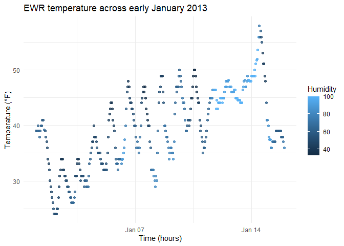

Homework 1
================
Satya Batna
2025-09-20

# Load the dataset

``` r
data("early_january_weather")
```

This data set has 358 rows and 15 columns. This data is the hourly
temperature from EWR in 2013. The variables that are listed are origin,
year, day, time, hour, temp, dewp, humid, wind_dir, wind_speed,
wind_gust,precip, pressure, visib, and time_hour.With mean 39.5821229
degrees.

``` r
ggplot(early_january_weather, aes(x = time_hour, y = temp, color = humid)) +
  geom_point(alpha = 0.8) +
  labs(
    x = "Time (hours)",
    y = "Temperature (°F)",
    color = "Humidity",
    title = "EWR temperature across early January 2013"
  ) +
  theme_minimal()
```

<!-- --> This
scatterplot shows us the increasing in temperature over time and for
lower humidity we have higher temperatures.

``` r
ggsave ("scatter_plot.pdf", height = 4, width = 6)
```
